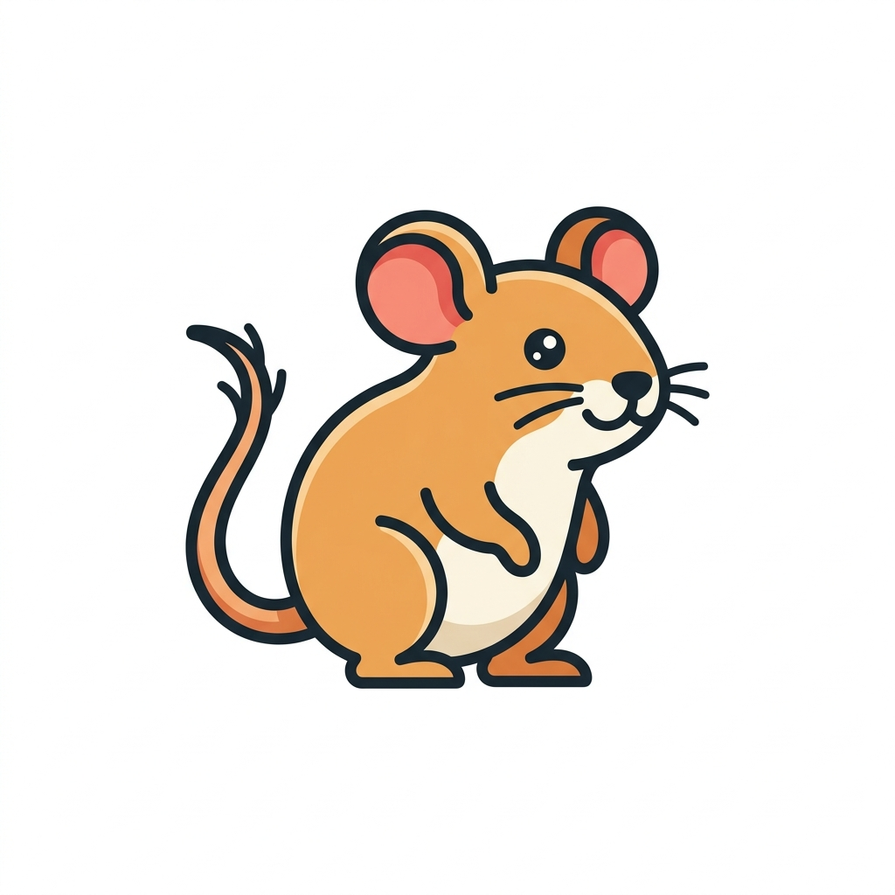

# MovaCore 🐭

  

**MovaCore** is a lightweight, blazing-fast, and "polite" keyboard layout converter for Windows. 
Born from the need to seamlessly switch text between English and Ukrainian (and vice versa) without the mess of standard clipboard tools.

---

## ✨ Features

- **Blazing Fast:** Built with **C# 8.0 & Native AOT**, ensuring instant startup and zero dependencies.
- **"Polite" Clipboard Handling:** Uses raw **Win32 P/Invoke** instead of high-level wrappers, overcoming common "Access Denied" or "COM Interop" issues.
- **Smart Retries:** Automatically handles clipboard locks from other applications (like Telegram or Browsers).
- **Architecture:** 
  - Non-blocking keyboard hooks via **SharpHook**.
  - Background task orchestration to ensure your input never lags.
- **Minimalist UI:** Sits quietly in your system tray with a cute field mouse mascot.

---

## 🚀 Getting Started

### Hotkeys
- **F10 (Release):** Highlighting a text and tapping F10 will instantly convert it to the other language layout (e.g., `ghbdtn` -> `привіт`).

### Installation
1. Download the latest `MovaCore.exe` from the [Releases](https://github.com/yourusername/MovaCore/releases) page.
2. Run as **Administrator** (recommended for access to clipboard in all apps).
3. Find the mouse icon in your system tray.

---

## 🛠 Tech Stack
- **Runtime:** .NET 8.0 (Native AOT)
- **Hooks:** [SharpHook](https://github.com/tolik-punko/SharpHook)
- **Core Logic:** Win32 P/Invoke for Clipboard management.
- **UI:** WinForms (System Tray)

---

## 🐭 Why the Mouse?
Like a field mouse, **MovaCore** is small, quiet, and very fast at moving "seeds" (your text) from one place to another.

---

## 📜 License
Published under the [MIT License](LICENSE).

---

Developed with ❤️ and AI pairing.
