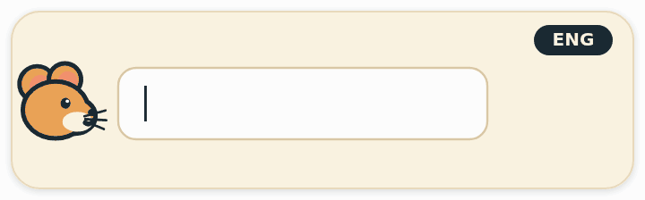
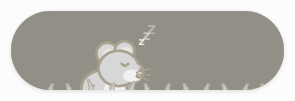

<p align="center">
  
</p>

<h1 align="center">MovaCore</h1>

<p align="center">
  <b>Fix text typed in the wrong keyboard layout (EN ↔ UA) with one key, and dictate offline with Whisper.</b><br>
  A free tray app for Windows.
</p>

<p align="center">
  <a href="https://github.com/cropsp/MovaCore/releases/latest"></a>
  <a href="https://github.com/cropsp/MovaCore/releases"></a>
  <a href="LICENSE"></a>
</p>

<p align="center">
  <a href="https://github.com/cropsp/MovaCore/releases/latest"></a>
</p>

<p align="center"><b>English</b> · <a href="README.uk.md">Українська</a></p>

<p align="center">
  <picture>
    <source media="(prefers-color-scheme: dark)" srcset="docs/media/convert-dark.gif">
    
  </picture>
</p>

## What it does

**Fix the layout.** Typed `ghbdsn` when you meant `привіт`? Select it and press **F10**. MovaCore retypes the text in
the other layout and switches your keyboard to that language. The text stays selected, so pressing **F10** again
undoes it. It works both ways (`Руддщ` → `Hello`) and in almost any app.

**Type with your voice.** Hold **ScrollLock**, speak, and let go. Whisper recognizes your speech on your own computer,
and the text appears where the cursor is. Nothing you say leaves your PC. [Set it up](#voice-input).

<p align="center">
  <picture>
    <source media="(prefers-color-scheme: dark)" srcset="docs/media/mouse-in-grass-dark.gif">
    
  </picture>
</p>

## Download and run

You need Windows 10 or 11. There is nothing to install: no installer, no administrator rights, no .NET.

1. Download `MovaCore-<version>-win-x64.zip` from the [latest release](https://github.com/cropsp/MovaCore/releases/latest)
   (`win-arm64` for ARM devices).
2. Extract the whole archive into a folder of your choice, for example `Documents\MovaCore`, and run `MovaCore.exe`.
   Keep the other files next to it.
3. A mouse icon appears in the system tray. Select some text and press **F10**.

> [!NOTE]
> The first time, Windows may say "Windows protected your PC". Choose **More info**, then **Run anyway**. SmartScreen
> warns about programs that few people have run yet, and MovaCore is not code-signed yet (see the
> [code signing policy](docs/CODE_SIGNING.md)). Each release lists the SHA-256 checksums of its files in
> `SHA256SUMS.txt`.

Right-click the tray icon for **Settings**, **Pause**, **About** and **Exit**; double-clicking it opens Settings. To
start MovaCore with Windows, turn on **Launch at Windows startup** in Settings → General.

## Voice input

1. In Settings → Voice, turn on **Voice input** and press **Save**. MovaCore downloads the speech model (874 MB) in the
   background, and the tray icon's tooltip shows the progress.
2. Click where the text should go, **hold ScrollLock**, speak, and let go.
3. The text appears at the cursor, and whatever you had copied is put back on the clipboard.

While you hold the key, the tray icon shows a red dot, and a small indicator at the bottom of the screen shows the
mouse in grass that grows with your voice. If the grass is grey and the mouse is dozing, the microphone is still
starting: wait until the grass turns green.

<details>
<summary>More about voice input</summary>

- **Models.** The default is Whisper Large v3 Turbo q8_0 (874 MB). On the Voice tab you can pick the full-precision
  model (1.6 GB, best with a graphics card), a smaller one (574 MB) for slower computers, or your own whisper.cpp
  model file (`ggml-*.bin`; GGUF files are not supported). A downloaded model can be deleted there to free disk space.
- **Speed.** On x64, **Use the graphics card (Vulkan)** makes recognition much faster (it takes effect after a
  restart). Without it, recognition runs on the processor, which needs AVX2 (most x64 processors made since 2013).
  **Faster recognition of short phrases** (experimental, on by default) makes Whisper process only as much audio as
  the phrase takes instead of 30 seconds; turn it off if phrases come out worse.
- **Language.** Whisper detects it automatically, or you can pick Ukrainian, English or another language.
- **Continuing a phrase.** If you dictate again right away, without typing or clicking in between, MovaCore adds a
  space and starts with a small letter when the sentence was not finished. After you type or click, it cannot know
  what is before the cursor, so the phrase is pasted as Whisper wrote it.
- **The microphone stays open** for 30 seconds after each dictation, so the next one starts instantly. Meanwhile
  Windows shows the microphone as in use, and a Bluetooth headset stays in its lower-quality headset mode.
- **The hotkey** can be changed on the Voice tab.

</details>

## Features

- **Undo with the same key.** The converted text stays selected; press the hotkey again to convert it back.
- **Keeps your clipboard.** After converting or dictating, MovaCore puts back whatever you had copied, and its own
  text stays out of Windows clipboard history (Win+V). You can turn this off.
- **Follows your layouts.** Conversion uses the English and Ukrainian layouts installed in Windows, including
  "Ukrainian (Enhanced)" with ґ.
- **Your choice of hotkey.** Any key, optionally with Ctrl, Shift, Alt or Win.
- **Stays out of the way.** Pause it from the tray, or list apps (for example `devenv` or `Code`) where the hotkey is
  left to the app.
- **Private voice input.** Whisper runs on your PC, on the graphics card where available.
- **Portable.** One folder, nothing to install. The interface is in English and Ukrainian.

## Privacy

- MovaCore watches the keyboard only to notice its hotkeys. It does not record or store what you type, and it reads
  the selected text only when you press the hotkey.
- Speech is recognized on your computer. Audio and recognized text are never saved or sent anywhere.
- There is no telemetry and no account. The only network connection is the speech model download from
  huggingface.co, after you turn voice input on.
- Settings are stored in `%APPDATA%\MovaCore\settings.json`, downloaded models in `%LOCALAPPDATA%\MovaCore\models`,
  and a diagnostic log in `%LOCALAPPDATA%\MovaCore\logs`. The log never contains your text, keystrokes or what you
  say.

The full statement is in the [privacy policy](docs/CODE_SIGNING.md#privacy-policy).

## Questions and answers

<details>
<summary>The hotkey does nothing in some windows</summary>

Windows does not let a regular app send keystrokes to programs running as administrator. To convert text there, run
MovaCore as administrator too ("Launch at Windows startup" always starts it without elevation). Also check that
MovaCore is not paused and that the app is not listed under **Disabled in applications** in Settings → General.

</details>

<details>
<summary>I need F10 in another program</summary>

Change the hotkey in Settings → Layout, or add that program to **Disabled in applications** in Settings → General.

</details>

<details>
<summary>Converting in a terminal interrupts the running command</summary>

In a terminal, Ctrl+C with nothing selected stops the running program. Choose **Ctrl+Insert / Shift+Insert** as the
copy and paste keys in Settings → General.

</details>

<details>
<summary>My antivirus warns about MovaCore</summary>

MovaCore watches the keyboard for its hotkeys (a global keyboard hook) and is not code-signed yet, which some
antivirus heuristics distrust. The source code is open, and releases are built by GitHub Actions from this
repository. Compare the SHA-256 of your download with `SHA256SUMS.txt` in the release, and report the false positive
to your antivirus vendor.

</details>

<details>
<summary>Voice input says "No speech heard" or types nothing</summary>

Check the microphone chosen in Settings → Voice and its input level in the Windows sound settings. Also make sure
Windows lets desktop apps use the microphone (Windows Settings → Privacy & security → Microphone).

</details>

<details>
<summary>Voice input is slow</summary>

On x64, turn on **Use the graphics card (Vulkan)** on the Voice tab and restart MovaCore. Otherwise, choose the smaller
model. Right after MovaCore starts, loading the model takes a few seconds.

</details>

<details>
<summary>How do I update?</summary>

Exit MovaCore from the tray, extract the new release over the old folder, and start it again. Your settings and the
downloaded model are kept.

</details>

<details>
<summary>How do I uninstall?</summary>

Turn off **Launch at Windows startup** in Settings → General, exit MovaCore from the tray and delete its folder. To
remove the settings, models and logs too, delete `%APPDATA%\MovaCore` and `%LOCALAPPDATA%\MovaCore`.

</details>

## For developers

MovaCore is written in C# on .NET 10 (WinForms) and published with Native AOT as a single `MovaCore.exe` plus the
native libraries next to it.

```powershell
dotnet build MovaCore.csproj                             # debug build (Windows)
dotnet test tests/MovaCore.Tests/MovaCore.Tests.csproj   # unit tests (any OS)
./publish.ps1                                            # Native AOT build, as released
```

- **Keyboard hook:** [SharpHook](https://github.com/TolikPylypchuk/SharpHook). The clipboard is handled through Win32
  directly, not through the WinForms wrappers.
- **Speech:** [whisper.cpp](https://github.com/ggml-org/whisper.cpp) through
  [Whisper.net](https://github.com/sandrohanea/whisper.net), voice activity detection with
  [Silero VAD](https://github.com/snakers4/silero-vad), and the microphone through [NAudio](https://github.com/naudio/NAudio)
  (WASAPI). The idea, and many details, come from [Handy](https://github.com/cjpais/Handy).
- **More:** [contributing](CONTRIBUTING.md), [changelog](CHANGELOG.md), [releasing](docs/RELEASING.md),
  [security](SECURITY.md), [third-party notices](THIRD-PARTY-NOTICES.txt).

Found a bug or have an idea? [Open an issue](https://github.com/cropsp/MovaCore/issues/new/choose).

## Why the mouse?

Like a field mouse, MovaCore is small, quiet and quick at carrying "seeds" (your text) from one place to another.

## License

MovaCore is published under the [MIT License](LICENSE).

Developed with ❤️ and AI pairing.
